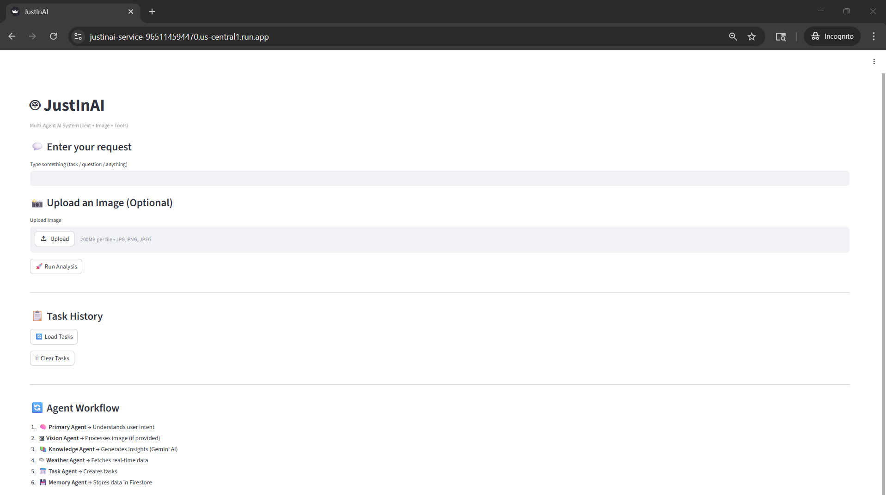
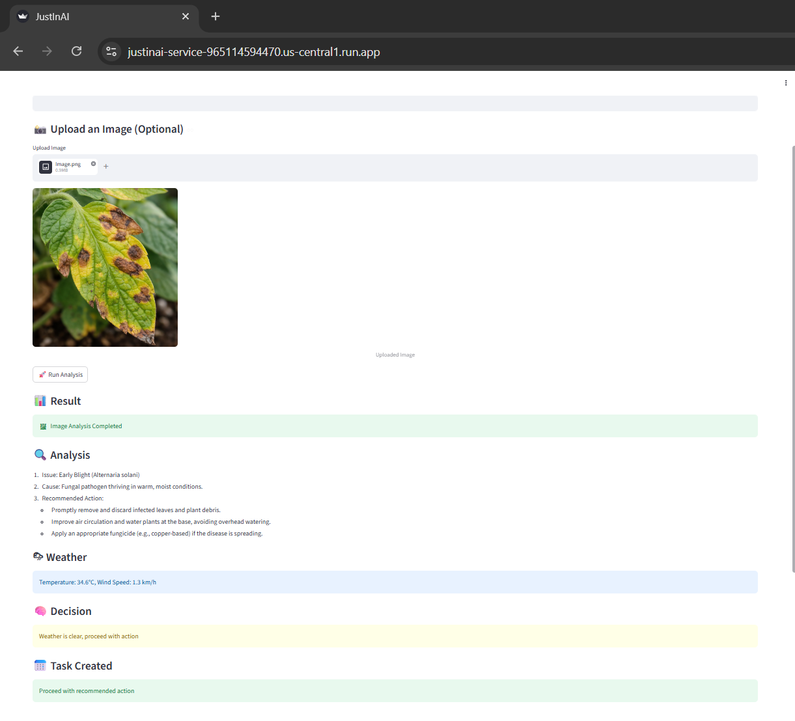
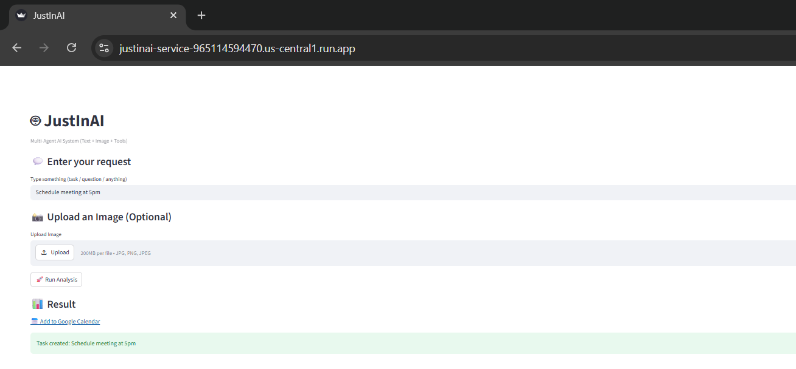

# JustInAI 🚀  
### GenAI APAC Hackathon Submission

JustInAI is a multi-agent AI system that transforms user input into actionable decisions by orchestrating multiple AI agents and tools.

---

## 🎯 Problem Statement

Users struggle to move from understanding a problem to taking action due to fragmented tools and lack of automation.

---

## 💡 Solution

JustInAI combines perception, reasoning, and execution using a multi-agent system powered by Vertex AI.

---

## 🔥 Key Features

- 🧠 Intent-aware AI (Gemini - Vertex AI)
- 📋 Task creation & tracking (Firestore)
- 📅 Smart calendar integration
- 🖼 Image analysis (Gemini Vision)
- 🌦 Weather-aware decision making
- 💾 Persistent memory system

---

## 🧠 Architecture

User Input (Text/Image)  
↓  
Primary Agent (Gemini)  
↓  
Task | Vision | Weather | Knowledge Agents  
↓  
Decision + Task Creation  
↓  
Firestore (Memory)  
↓  
Streamlit UI  

---

## ☁️ Google Tech Stack

- Vertex AI (Gemini 2.5 Flash)
- Firestore
- Cloud Run
- FastAPI
- Streamlit

---

## 🚀 Deployment

🔗 Cloud Run API:  
https://justinai-service-965114594470.us-central1.run.app

---

## 📸 Demo

### UI

### Image Analysis

### Task & Calendar

---

## 🎥 Demo Video

(Add your video link here)

---

## 👨‍💻 Author

Justin Paul
